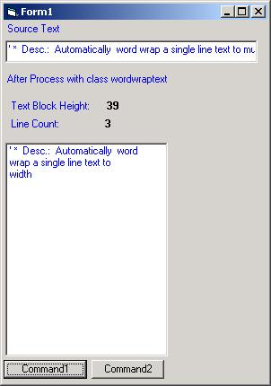



## Auto wordwrap text with the fixed width

### Description

Sometime the string of a item in some grid or list control is too long to display it complete.

So we want to auto display it with multi-line.

My code just do it,It auto wordwrap the string with fixed width.

You can define the dismember of each word,such as ",","?",":",and so on.

after processing,this class will return the conten of each line ,and the height of block text following the font of hdc
 
### More Info
 

             |
---                |---
**Submitted On**   |2004-04-08 00:19:02
**By**             |[Nolan Shang](https://github.com/Planet-Source-Code/PSCIndex/blob/master/ByAuthor/nolan-shang.md)
**Level**          |Intermediate
**User Rating**    |4.0 (8 globes from 2 users)
**Compatibility**  |VB 5\.0, VB 6\.0
**Category**       |[Coding Standards](https://github.com/Planet-Source-Code/PSCIndex/blob/master/ByCategory/coding-standards__1-43.md)
**World**          |[Visual Basic](https://github.com/Planet-Source-Code/PSCIndex/blob/master/ByWorld/visual-basic.md)
**Archive File**   |[Auto\_wordw173050482004\.zip](https://github.com/Planet-Source-Code/nolan-shang-auto-wordwrap-text-with-the-fixed-width__1-52965/archive/master.zip)

